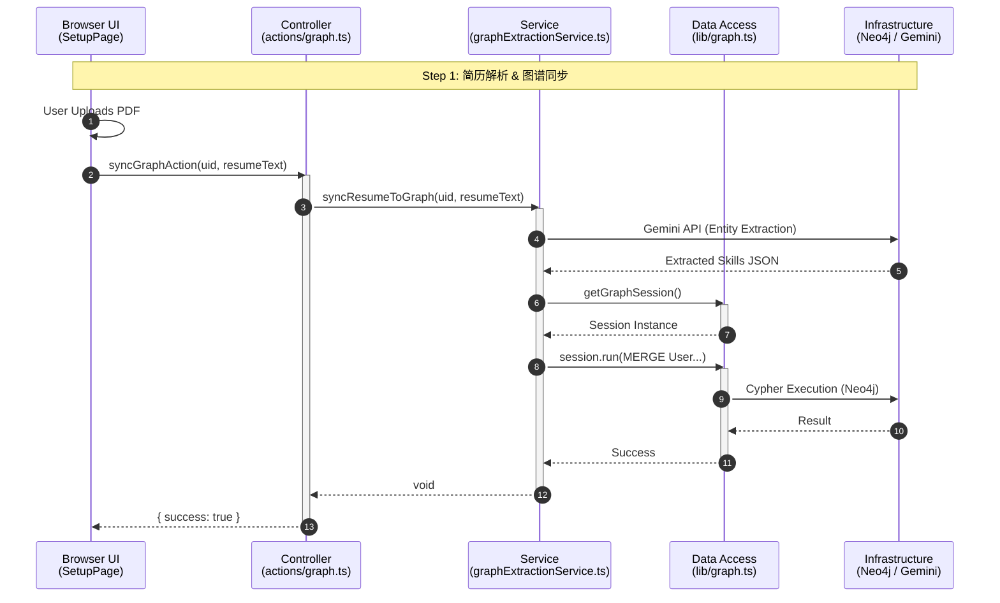
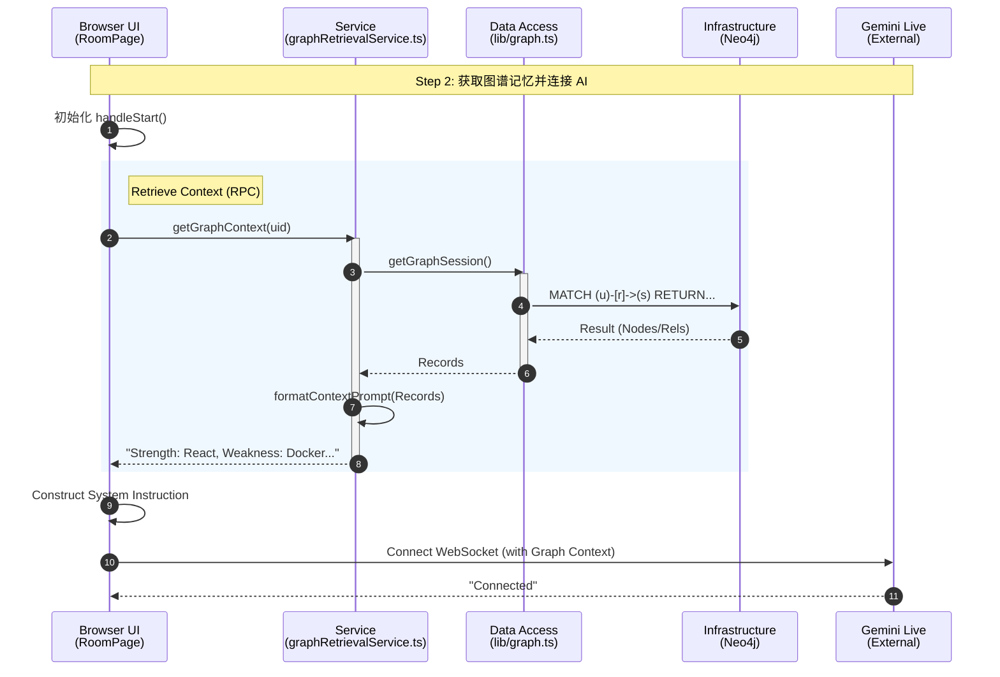
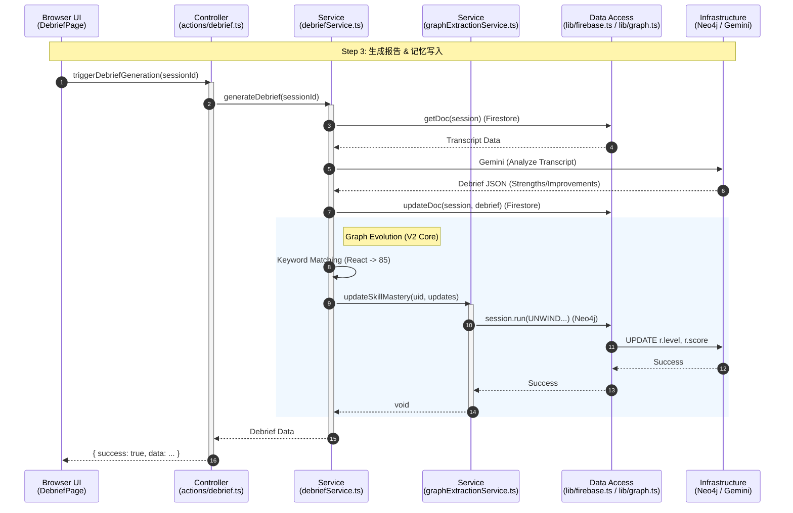
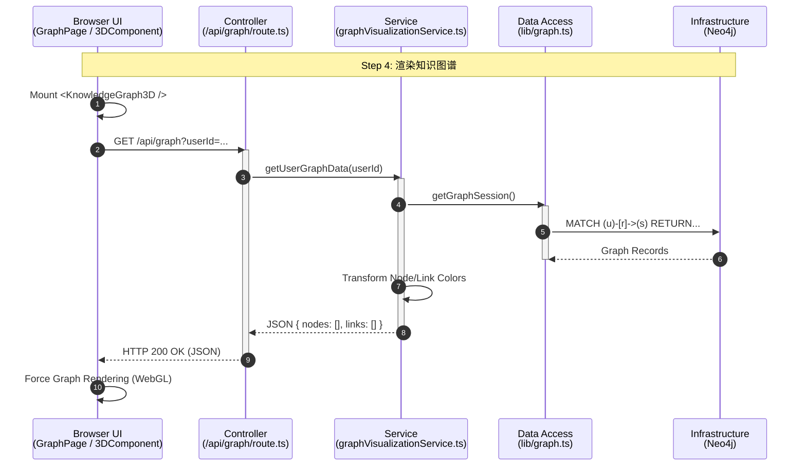
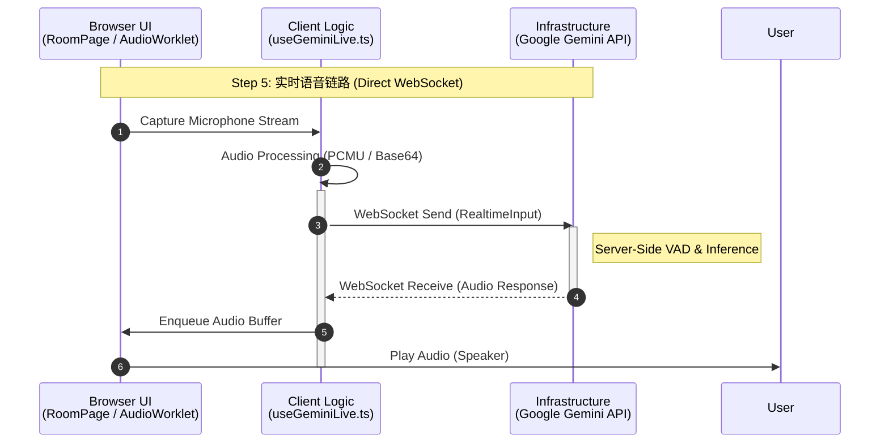
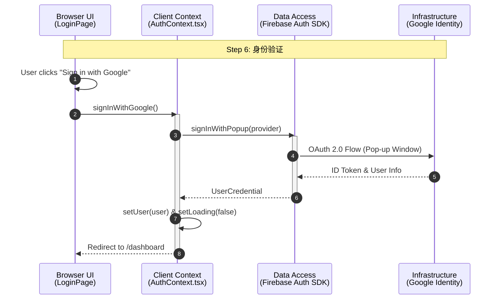

# Interview App V2 - 架构时序图 (Layered Architecture)

## 🏗️ 分层定义 (Layers)

1.  **Browser (UI)**: React Components (`src/app/**/page.tsx`, `src/components/**`). 运行在浏览器。
2.  **Control (Controller)**: Server Actions (`src/app/actions/**`) 或 API Routes。作为前后端边界，运行在服务器。
3.  **Service (Business Logic)**: 核心业务逻辑 (`src/services/**`)。运行在服务器。
4.  **Data Access (DAO)**: 数据库连接与原子操作 (`src/lib/**`)。
5.  **Infrastructure (External)**: 外部服务与数据库 (Neo4j, Firestore, Google Gemini)。

---

## 1. 简历解析与图谱构建 (Resume Sync Flow)
**场景**：用户在 Setup 页面上传简历，系统解析并同步到知识图谱。

---

## 2. 面试初始化：图谱指令注入 (Context Injection Flow)
**场景**：用户进入房间，系统获取其技能图谱上下文，生成 AI 系统指令。

---

## 3. 面试复盘：图谱动态更新 (Feedback & Update Flow)
**场景**：面试结束，系统生成复盘报告，并反向更新图谱中的技能评分。

---

## 4. 可视化查看 (Visualization Flow)
**场景**：Dashboard 加载 3D 知识星球。

---

## 5. 实时语音交互 (Real-time Interaction)
**场景**：面试中，WebSocket 音频流的实时处理。由于走的是 WebSocket 直接连接 Google，这里没有经过 Next.js 后端。

---

## 6. 用户认证 (Authentication)
**场景**：用户登录/注册，由 Firebase SDK 直接托管。

